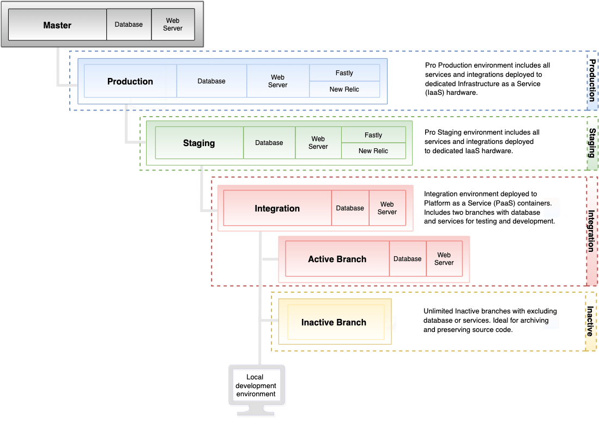

# Architecture pro

Votre architecture Adobe Commerce on cloud infrastructure Pro prend en charge plusieurs environnements que vous pouvez utiliser pour développer, tester et lancer votre boutique.

- **Principal**—Fournit une branche `master` déployée sur les conteneurs Platform as a service (PaaS).
- **Intégration** : fournit une branche `integration` unique pour le développement, bien que vous puissiez créer une branche supplémentaire. Cela permet de déployer jusqu’à deux branches _actives_ sur les conteneurs Platform as a Service (PaaS).
- **Staging** : fournit une branche `staging` unique déployée sur les conteneurs IaaS (Infrastructure as a service) dédiés.
- **Production** : fournit une branche `production` unique déployée sur les conteneurs IaaS (Infrastructure as a service) dédiés.

Le tableau suivant résume les différences entre les environnements :

|                                        | INTÉGRATION | ÉVALUATION | PRODUCTION |
| -------------------------------------- | ----------- | ----------------- | -------------------- |
| Prend en charge la gestion des paramètres dans le [!DNL Cloud Console] | Oui | Limité | Limité |
| Prend en charge plusieurs branches | Oui | Non (évaluation uniquement) | Non (production uniquement) |
| Utilise des fichiers YAML pour la configuration | Oui | Non | Non |
| S’exécute sur du matériel IaaS dédié | Non | Oui | Oui |
| Inclut le réseau CDN Fastly | Non | Oui | Oui |
| Inclut le service New Relic | Non | APM | APM + NRI |
| Sauvegardes automatiques | Non | Oui | Oui |

>[!NOTE]
>
>Adobe fournit l’outil Cloud Docker for Commerce pour un déploiement sur un environnement Cloud Docker local afin que vous puissiez développer et tester des projets Adobe Commerce. Voir [Développement Docker](../dev-tools/cloud-docker.md).

## Architecture de l’environnement

Votre projet est un référentiel Git unique avec trois branches d’environnement principales : `integration`, `staging` et `production`. Le diagramme suivant illustre la relation hiérarchique des environnements Pro :



### environnement de Principal

Dans les projets Pro, la branche `master` fournit un environnement PaaS actif avec votre environnement de production. Envoyez toujours une copie du code de production à l’environnement de `master` afin de pouvoir déboguer l’environnement de production sans interrompre les services.

**Avertissements:**

- Ne créez **pas** une branche basée sur la branche `master`. Utilisez l’environnement d’intégration pour créer des branches actives pour le développement.

- N’utilisez pas l’environnement `master` pour le développement, l’UAT ou les tests de performance

### Environnement d’intégration

L’environnement d’intégration s’exécute dans un conteneur Linux (LXC) sur une grille de serveurs appelée PaaS. Chaque environnement comprend un serveur web et une base de données pour tester votre site. Consultez la section [Adresses IP régionales](../project/regional-ip-addresses.md) pour obtenir une liste des adresses IP AWS et Azure.

**Cas d’utilisation recommandés :**

Les environnements d’intégration sont conçus pour des tests et un développement limités avant de déplacer les modifications vers des environnements d’évaluation et de production. Par exemple, vous pouvez utiliser l’environnement d’intégration pour effectuer les tâches suivantes :

- Assurez-vous que les modifications apportées aux processus d’intégration continue (CI) sont compatibles avec le cloud

- Testez les workflows critiques sur des pages clés telles que l’accueil, la catégorie, la page de détails du produit (PDP), le passage en caisse et l’administrateur.

Pour de meilleures performances dans l’environnement d’intégration, suivez ces bonnes pratiques :

- Limiter la taille du catalogue : à titre de référence, les données d’exemple contiennent environ 2 048 produits. Essayez de réduire la taille de votre catalogue à environ 4 000 à 5 000 produits.
Pour vérifier le nombre de produits dans le catalogue, exécutez la requête MySQL suivante :

  ```sql
  select distinct count(entity_id) from catalog_product_entity;
  ```

- Réduire le nombre de groupes de clients et clientes : un trop grand nombre de groupes de clients et clientes peut affecter les performances d’indexation et les performances globales.

- Limiter l’utilisation à un ou deux utilisateurs simultanés

- Désactivez les tâches cron et exécutez-les manuellement si nécessaire.

**Avertissements:**

- Les services Fast CDN et New Relic ne sont pas accessibles dans un environnement d’intégration

- L&#39;architecture de l&#39;environnement d&#39;intégration ne correspond pas à l&#39;architecture d&#39;évaluation et de production

- N’utilisez pas l’environnement `integration` pour les tests de développement, les tests de performance ou les tests d’acceptation utilisateur (UAT)

- N’utilisez pas l’environnement `integration` pour tester la fonctionnalité B2B d’Adobe Commerce

- Vous ne pouvez pas restaurer la base de données dans l&#39;environnement d&#39;intégration à partir de la base de données de production ou d&#39;évaluation

{{enhanced-integration-envs}}

### Environnement d’évaluation

L’environnement d’évaluation fournit un environnement de quasi-production pour tester votre site. Cet environnement, qui est hébergé sur du matériel IaaS dédié, inclut tous les services, tels que le réseau CDN Fastly, l’APM New Relic et la recherche.

**Cas d’utilisation recommandés :**

L’environnement correspond à l’architecture de production et est conçu pour l’UAT, l’évaluation du contenu et la révision finale avant d’intégrer des fonctionnalités à l’environnement de `production`. Par exemple, vous pouvez utiliser l’environnement `staging` pour effectuer les tâches suivantes :

- Test de régression par rapport aux données de production

- Tests de performance avec la mise en cache Fastly activée

- Tester de nouvelles versions au lieu d’appliquer des correctifs en production

- Test UAT pour les nouvelles versions

- Test B2B pour Adobe Commerce

- Personnalisation de la configuration cron et test des tâches cron

Voir [Workflow de déploiement](pro-develop-deploy-workflow.md#deployment-workflow) et [Test du déploiement](../test/staging-and-production.md).

**Avertissements:**

- Après le lancement du site de production, utilisez principalement l’environnement d’évaluation pour tester les correctifs pour les correctifs critiques de production.

- Vous ne pouvez pas créer de branche à partir de la branche `staging`. Au lieu de cela, vous poussez les modifications de code de la branche `integration` vers la branche `staging`.

{{second-staging}}

### Environnement de production

L’environnement de production exécute vos storefronts uniques et multi-sites accessibles au public. Cet environnement s’exécute sur du matériel IaaS dédié avec des nœuds redondants et haute disponibilité pour un accès continu et une protection de basculement pour vos clients. L’environnement de production comprend tous les services de l’environnement d’évaluation, ainsi que le service [New Relic Infrastructure (NRI)](../monitor/new-relic-service.md#new-relic-infrastructure), qui se connecte automatiquement aux données de l’application et à l’analyse des performances pour fournir une surveillance dynamique du serveur.

**Caveat:**

Vous ne pouvez pas créer de branche à partir de la branche `production`. Au lieu de cela, vous poussez les modifications de code de la branche `staging` vers la branche `production`.

### Pile de technologie de production

L’environnement de production dispose de trois machines virtuelles derrière un équilibreur de charge élastique géré par un proxy HAP par machine virtuelle. Chaque machine virtuelle comprend les technologies suivantes :

- **Fast CDN** : mise en cache HTTP et réseau CDN

- **NGINX** : serveur web utilisant PHP-FPM, une instance avec plusieurs workers

- **GlusterFS** : serveur de fichiers pour gérer tous les déploiements de fichiers statiques et la synchronisation avec quatre montages de répertoire :

   - `var`
   - `pub/media`
   - `pub/static`
   - `app/etc`

- **Redis** : un serveur par machine virtuelle avec un seul actif et les deux autres comme répliques.

- **Elasticsearch**—recherchez Adobe Commerce sur les infrastructures cloud 2.2 à 2.4.3-p2

- **OpenSearch** : recherchez Adobe Commerce sur les infrastructures cloud 2.3.7-p3, 2.4.3-p2, 2.4.4 et versions ultérieures.

- **Galera**—cluster de bases de données avec une base de données MariaDB MySQL par nœud avec un paramètre d’incrémentation automatique de trois pour les identifiants uniques dans chaque base de données

La figure suivante présente les technologies utilisées dans l’environnement de production :


## Matériel redondant

Plutôt que d’exécuter une `master` traditionnelle active-passive ou une configuration primaire-secondaire, Adobe Commerce sur l’infrastructure cloud exécute une _architecture redondante_ où les trois instances acceptent les lectures et les écritures. Cette architecture n’offre aucun temps d’arrêt lors de la mise à l’échelle et garantit l’intégrité transactionnelle.

En raison du matériel unique et redondant, Adobe peut fournir trois serveurs de passerelle. La plupart des services externes vous permettent d’ajouter plusieurs adresses IP à une liste autorisée. Par conséquent, le fait d’avoir plusieurs adresses IP fixes ne pose pas de problème. Les trois passerelles se mappent aux trois serveurs de votre cluster d’environnement de production et conservent des adresses IP statiques. Il est entièrement redondant et hautement disponible à tous les niveaux :

- DNS
- Réseau de diffusion de contenu (CDN)
- Répartition de charge élastique (ELB)
- Cluster à trois serveurs regroupant tous les services Adobe Commerce, notamment la base de données et le serveur web

## Sauvegarde et reprise après sinistre

Adobe Commerce sur les infrastructures cloud utilise une architecture à haute disponibilité qui reproduit chaque projet Pro sur trois zones de disponibilité AWS ou Azure distinctes, chaque zone disposant d’un centre de données distinct. En plus de cette redondance, les environnements d’évaluation et de production Pro bénéficient de sauvegardes en direct régulières conçues pour être utilisées en cas de _défaillance catastrophique_.

**Les sauvegardes automatiques** incluent les données persistantes de tous les services en cours d&#39;exécution, tels que la base de données MySQL et les fichiers stockés sur les volumes montés. Les sauvegardes sont enregistrées dans le stockage par blocs élastiques (EBS) chiffré dans la même région que l’environnement de production. Les sauvegardes automatiques ne sont pas accessibles au public, car elles sont stockées dans un système distinct.

>[!NOTE]
>
>Les volumes montés ne comprennent/ne font référence qu&#39;aux [montages inscriptibles](https://experienceleague.adobe.com/en/docs/commerce-on-cloud/user-guide/configure/app/properties/properties#mounts) et n&#39;incluent pas l&#39;ensemble de votre répertoire `app/`. Quant aux autres fichiers, ils sont créés/générés par le [processus de création et de déploiement](https://experienceleague.adobe.com/en/docs/commerce-on-cloud/user-guide/architecture/pro-develop-deploy-workflow#deployment-workflow) et vous devrez également vérifier votre référentiel Git pour les fichiers restants.

{{pro-backups}}

Vous pouvez créer une **sauvegarde manuelle** de la base de données pour vos environnements d’évaluation et de production à l’aide de commandes d’interface de ligne de commande. Pour plus d&#39;informations, consultez la section [ Sauvegarder la base de données ](../storage/database-dump.md). Pour les environnements `integration`, Adobe recommande de commencer par créer une sauvegarde après avoir accédé à votre projet d’infrastructure cloud Adobe Commerce et avant d’appliquer des modifications majeures. Voir [ Gestion des sauvegardes ](../storage/snapshots.md).

### Objectif du point de récupération

Contactez votre responsable du succès client Adobe pour plus d’informations sur l’objectif du point de récupération et l’heure de la dernière sauvegarde. La fréquence des sauvegardes dépend du planning de sauvegarde de votre plan et du volume de modifications à écrire dans le service de stockage.

### Politique de rétention

L’Adobe conserve les sauvegardes automatiques conformément à la politique de conservation des données suivante :

| Période | Politique de conservation des sauvegardes |
| ------------------ | ----------------------- |
| Jour 1 à 3 | Une sauvegarde par heure |
| Jours 4 à 7 | Une sauvegarde par jour |
| Semaines 2 à 6 | Une sauvegarde par semaine |
| Semaines 8 à 12 | Une sauvegarde toutes les deux semaines |
| Mois 3 à 5 | Une sauvegarde par mois |

Cette politique peut varier en fonction de votre plan d’infrastructure cloud.

### Objectif de temps de récupération

Le RTO dépend de la taille du stockage. La restauration des gros volumes EBS prend plus de temps. Les délais de restauration peuvent varier en fonction de la taille de votre base de données. Pour plus d’informations, contactez votre responsable du succès client Adobe.

## Mise à l’échelle de Pro Cluster

Le dimensionnement du cluster Pro et les configurations _compute_ varient en fonction du fournisseur de cloud choisi (AWS, Azure), de la région et des dépendances de service. L&#39;infrastructure cloud d&#39;Adobe peut adapter les clusters Pro aux attentes en matière de trafic et aux exigences de service en fonction de l&#39;évolution des demandes.

L’architecture redondante permet à l’infrastructure cloud d’Adobe de se mettre à niveau sans temps d’arrêt. Lors de la mise à l’échelle, chacune des trois instances effectue une rotation pour mettre à niveau la capacité sans affecter le fonctionnement du site. Par exemple, vous pouvez ajouter des serveurs web supplémentaires à un cluster existant au cas où le niveau de restriction serait PHP plutôt qu&#39;au niveau de la base de données. Cette mise à l’échelle _horizontale_ complète la mise à l’échelle verticale fournie par des processeurs supplémentaires au niveau de la base de données. Pour plus d&#39;informations, consultez la section [Architecture évolutive](scaled-architecture.md).

Si vous prévoyez une augmentation significative du trafic pour un événement ou pour une autre raison, vous pouvez demander une augmentation temporaire de la capacité. Consultez [Comment demander une mise à niveau temporaire](https://experienceleague.adobe.com/docs/commerce-knowledge-base/kb/how-to/how-to-request-temporary-magento-upsize.html) dans le Centre d’aide de Commerce __.
