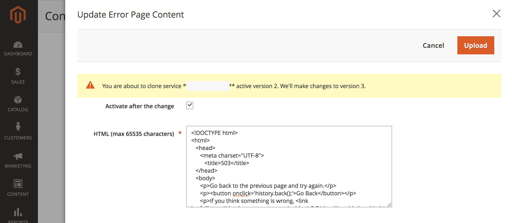
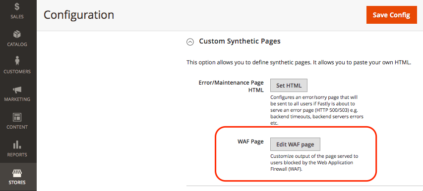

# Personnaliser les pages d’erreur et de maintenance

Lorsqu’une requête à l’origine Fastly échoue, Fastly renvoie les pages de réponse par défaut avec une mise en forme de base et un message générique qui peut être déroutant pour les utilisateurs et les utilisatrices. Par exemple, Fastly renvoie la page d’erreur par défaut suivante lorsqu’une requête vers l’origine Fastly échoue en raison d’une erreur 503.


Vous pouvez mettre à jour la configuration de votre boutique Adobe Commerce pour remplacer certaines pages de réponse par défaut par des pages proposant une messagerie plus conviviale et un style d’HTML amélioré, comme illustré dans l’exemple suivant.


Actuellement, vous pouvez personnaliser les pages de réponse Fastly suivantes pour votre projet d’infrastructure cloud Adobe Commerce.

- [Erreurs du serveur : erreur interne du serveur, dépassement de délai ou pannes de maintenance du site (code d’erreur 500 ou supérieur).](#customize-the-503-error-page)
- [Événements de blocage WAF qui se produisent lorsque le WAF détecte un trafic de requête suspect (403 Interdit)](#customize-the-waf-error-page)

**Exigences de codage d’HTML :**

Le code d’HTML de la page personnalisée doit répondre aux exigences suivantes :

- Le contenu peut contenir jusqu’à 65 535 caractères.
- Spécifiez tous les CSS intégrés dans la source d’HTML.
- Regroupez les images dans la page HTML à l’aide de base64 afin qu’elles s’affichent même si Fastly est hors ligne. Voir [URI de données sur le site CSS-tricks](https://css-tricks.com/data-uris/).

## Personnaliser la page d’erreur 503

Les clients voient la page d’erreur 503 par défaut dans les cas suivants :

- Lorsqu’une requête à l’origine Fastly renvoie un statut de réponse supérieur à 500
- Lorsque l’origine Fastly est inactive, comme une temporisation, une activité de maintenance ou des problèmes d’intégrité

Vous pouvez personnaliser la page par défaut en adaptant le code d’HTML ci-après pour inclure le style afin qu’il corresponde au thème de votre boutique Adobe Commerce, puis en modifiant le titre et le message selon vos besoins.

```html
<!DOCTYPE html>
<html>
   <head>
      <meta charset="UTF-8">
         <title>503</title>
   </head>
   <body>
      <p>Service unavailable</p>
   </body></html>
```

Vérifiez que la source modifiée s’affiche correctement dans le navigateur. Ajoutez ensuite le code d’HTML personnalisé à la configuration Fastly .

Pour ajouter la page de réponse personnalisée à la configuration Fastly :

{{admin-login-step}}

1. Sélectionnez **Magasins** > **Paramètres** > **Configuration** > **Avancé** > **Système**.

1. Dans le volet de droite, développez **Cache de page complet** > **Configuration rapide** > **Pages synthétiques personnalisées**.

   

1. Sélectionnez **Définir l’HTML**.

1. Copiez et collez le code source de votre page de réponse personnalisée dans le champ HTML .

   

1. Sélectionnez **Charger** en haut de la page pour charger la source d’HTML personnalisée sur le serveur Fastly.

1. Sélectionnez **Enregistrer la configuration** en haut de la page pour enregistrer le fichier de configuration mis à jour.

1. Actualisez le cache.

   - Dans la notification en haut de la page, cliquez sur le lien *Gestion du cache*.

   - Sur la page Gestion du cache, sélectionnez **Vider le cache du Magento**.

## Personnaliser la page d’erreur WAF

Les clients voient la page d’erreur WAF suivante par défaut lorsqu’une demande de l’origine Fastly échoue avec une erreur `403 Forbidden` due à un événement de blocage [WAF](fastly-waf-service.md).


L’exemple de code suivant montre la source d’HTML de la page par défaut :

```html
<html>
  <head>
    <title>Magento 403 Forbidden</title>
  </head>
  <body>
    <p>The requested URL was rejected.</p>
    <p>For additional information, please contact support and provide this reference ID:</p>
    <p>"} req.http.x-request-id {"</p>
    <p><button onclick='history.back();'>Go Back</button></p>
  </body>
</html>
```

Vous pouvez utiliser l’option **Pages synthétiques personnalisées** > **Modifier la page WAF** dans le menu de configuration Fastly pour personnaliser le code par défaut de votre projet d’infrastructure cloud Adobe Commerce. Lorsque vous modifiez le code, conservez la ligne suivante qui fournit l’identifiant de référence pour l’événement de blocage WAF :

```html
<p>"} req.http.x-request-id {"</p>
```

>[!NOTE]
>
>L’option Modifier WAF est disponible uniquement si le service Managed Cloud WAF est activé pour votre projet d’infrastructure cloud Adobe Commerce.

**Pour modifier la page d’erreur WAF** :

1. [Connectez-vous à Admin](../../get-started/onboarding.md#access-your-admin-panel).

1. Sélectionnez **Magasins** > **Paramètres** > **Configuration** > **Avancé** > **Système**.

1. Dans le volet de droite, développez **Cache de page complet** > **Configuration rapide** > **Pages synthétiques personnalisées**.

   

1. Sélectionnez **Modifier la page WAF**.

1. Renseignez les champs pour mettre à jour l’HTML.

   

   - **Statut** — Sélectionnez le statut du `403 Forbidden`.
   - **Type MIME** — Type `text/html`.
   - **Contenu** — Modifiez la réponse d’HTML par défaut pour ajouter un CSS personnalisé et mettre à jour le titre et le message selon les besoins.

1. Sélectionnez **Charger** en haut de la page pour charger la source d’HTML personnalisée sur le serveur Fastly.

1. Sélectionnez **Enregistrer la configuration** en haut de la page pour enregistrer le fichier de configuration mis à jour.

1. Actualisez le cache.

   - Dans la notification en haut de la page, cliquez sur le lien **Gestion du cache**.

   - Sur la page Gestion du cache, sélectionnez **Vider le cache du Magento**.

## Afficher le numéro de rapport d’erreur

Par défaut, Fastly masque toutes les erreurs Adobe Commerce derrière l’erreur Service *503 indisponible* . Pour afficher le numéro de rapport du journal des erreurs afin que vous puissiez trouver et consulter les détails des erreurs dans les journaux, ouvrez le site web en omettant Fastly à l’aide des étapes suivantes :

1. Récupérez l’adresse IP de votre boutique :

   - Pour les environnements d’évaluation et de production Pro :

     ```bash
     nslookup {your_project_id}.ent.magento.cloud
     ```

   - Pour les environnements d’intégration Pro et les environnements de démarrage :

     ```bash
     nslookup gw.{your_region}.magentosite.cloud
     ```

1. Ajoutez votre domaine d&#39;application et votre adresse IP au fichier des hôtes sur votre station de travail locale :

   ```text
   {server_IP} {store_domain}
   ```

1. Effacez le cache et les cookies du navigateur (ou passez en mode navigation privée).

1. Ouvrez à nouveau le site web de votre boutique pour afficher le code d’erreur.

1. Utilisez le code d’erreur pour rechercher les détails dans le fichier de rapport d’erreur :

   - [Connexion à l’environnement affecté à l’aide de SSH](../development/secure-connections.md#connect-to-a-remote-environment)

   - Recherchez le fichier `./var/report/{error_number}`.
