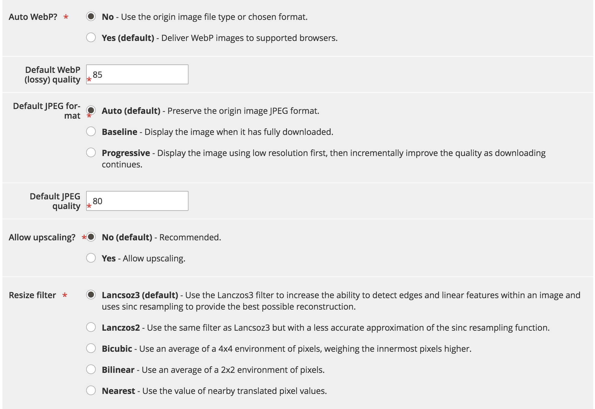

# Optimisation rapide des images

Fastly image optimization (Fastly IO) permet une manipulation et une optimisation des images en temps réel afin d’accélérer la diffusion des images et de simplifier la maintenance des ensembles de sources d’images pour les applications web réactives. Une fois configurée, Fastly IO offre les fonctionnalités d’optimisation d’image suivantes :

- Forcer la conversion avec perte
- Optimisation des images profondes
- Rapports de pixels adaptatifs
- Prise en charge des formats d’image courants : PNG, JPEG, GIF et WebP

Avant d’activer et de configurer l’option Fastly IO, vous devez configurer votre service Fastly et configurer le blindage d’origine.

En fonction de vos paramètres de configuration, le fragment de code Fastly Image Optimization (Fastly IO) insère le code VCL pour effectuer l’optimisation des images qui accélère la diffusion des images du produit dans le storefront. Il existe trois étapes pour configurer l’E/S Fastly : activer, configurer et vérifier.

## Activer Fast IO

Activez l’optimisation des images Fastly IO (Fastly IO) à partir du panneau d’administration en chargeant le fragment de code VCL Fastly IO. Le fragment de code fournit les instructions de configuration Fastly pour traiter toutes les images par le biais des optimiseurs d’images, à l’aide des configurations par défaut.

**Conditions préalables :**

- Installez ou mettez à niveau vers le module Fastly version 1.2.62 ou ultérieure.
- [Configuration du bouclier et du serveur principal Fastly Origin](fastly-custom-cache-configuration.md#configure-back-ends-and-origin-shielding)

**Pour activer Fastly IO** :

1. Connectez-vous au panneau local [Admin](../../get-started/onboarding.md#access-your-admin-panel) en tant qu’administrateur.

1. Sélectionnez **Magasins** > **Paramètres** > **Configuration** > **Avancé** > **Système**.

1. Dans le volet de droite, développez **Cache de page complet**.

1. Sélectionnez **Configuration rapide** > **Optimisation des images** pour spécifier les paramètres de configuration.

1. Dans le champ _Extrait de code d’E/S rapide_, sélectionnez **Activer/Désactiver**.

1. Chargez le fragment de code d’E/S Fastly :

   - Sélectionnez **Options de configuration d’E/S par défaut** pour ouvrir la page Options de configuration par défaut de l’optimisation des images.
   - Sélectionnez **Télécharger** pour télécharger le fragment de code VCL sur votre serveur.

## Configuration des E/S Fastly

Vérifiez et mettez à jour les paramètres de configuration d’E/S par défaut pour l’optimisation des images si nécessaire. Par exemple, vous pouvez modifier les niveaux de qualité du WebP et du JPEG pour les formats avec perte, ou modifier le format de diffusion des images du JPEG en _Progressif_ ou _Ligne de base_. En outre, vous pouvez utiliser Fastly IO pour des fonctionnalités d’optimisation d’image plus granulaires, telles que :

- Forcer la conversion avec perte
- Optimisation des images profondes
- Rapports de pixels adaptatifs

**Pour mettre à jour Fastly IO** :

1. Sur la page _Configuration Fastly_ dans le champ _Options de configuration d’E/S par défaut_, sélectionnez **Configurer**.

   

1. Examinez et mettez à jour les paramètres de configuration Fastly IO sur la page _Options de configuration par défaut de l’optimisation des images_ :

   

   - **Auto WebP ?** : conservez le paramètre par défaut (`Yes`) pour convertir les images au format WebP dans les navigateurs qui le prennent en charge. Si vous définissez le paramètre sur **Non**, Fastly utilise le type de fichier image au lieu de convertir l’image au format WebP.

   - **Qualité WebP par défaut (avec perte)**—conservez le paramètre par défaut (`85`) ou tapez le niveau de compression des images avec perte au format fichier. Vous pouvez indiquer tout nombre entier compris entre 1 et 100.

   - **Contrôles de format de JPEG par défaut** — conservez le paramètre par défaut (`Auto`) ou sélectionnez le type de JPEG à utiliser lors de la diffusion d&#39;une image. Si la valeur est définie sur _Auto_, Fastly diffuse des images dont le type de sortie correspond au type d’entrée. Sélectionnez _Ligne de base_ pour afficher les images ligne par ligne, en commençant par le coin supérieur gauche et en descendant vers le coin inférieur droit. Sélectionnez _Progressif_ pour afficher une image floue qui devient claire au chargement.

   - **Qualité du JPEG par défaut** : conservez le paramètre par défaut (`85`) ou saisissez le niveau de compression pour la qualité des formats de fichiers avec perte. Spécifiez un nombre entier compris entre 1 et 100.

   - **Autoriser la mise à l’échelle ?** : laissez le paramètre par défaut (`No`) ou sélectionnez `Yes` pour renvoyer des images plus grandes que le fichier source d&#39;origine afin qu&#39;elles puissent s&#39;adapter aux dimensions demandées.

   - **Redimensionner le filtre** : conservez le paramètre par défaut (`Lancsoz3`) ou sélectionnez une autre option. Ce paramètre spécifie le filtre utilisé pour diffuser une image redimensionnée. Selon le filtre sélectionné, l’image redimensionnée peut avoir un nombre de pixels plus ou moins élevé.

      - `Lanczos3` (par défaut) : fournit une image de la meilleure qualité. Il augmente la capacité à détecter les contours et les caractéristiques linéaires dans une image et utilise le rééchantillonnage _[!DNL sinc]_pour fournir la meilleure reconstruction possible.
      - `Lanczos2` : utilise le même filtre que `Lancsoz3`, mais avec une approximation moins précise de la fonction de rééchantillonnage _[!DNL sinc]_.
      - `Bicubic` : a un effet d&#39;accentuation naturel lors de la réduction de la taille d&#39;une image.
      - `Bilinear` : produit un effet de lissage naturel lorsque vous agrandissez une image.
      - `Nearest` : produit un effet de pixellisation naturel lors du redimensionnement de l&#39;image au pixel.

1. Après avoir spécifié les paramètres de configuration d’E/S pour le service Fastly, sélectionnez **Annuler** pour revenir aux paramètres de configuration Fastly.

1. Dans le champ Configuration de l’optimisation des images _Activer l’optimisation des images profondes_, sélectionnez **Oui** pour activer l’optimisation des images profondes.

   

   L’optimisation des images profondes est désactivée par défaut. Lorsque cette fonction est activée, la fonction de redimensionnement intégrée d’Adobe Commerce est désactivée et le travail de redimensionnement est déchargé sur le service Fastly IO. L’optimisation des images s’applique uniquement aux images de produit. Les images CMS ne sont pas redimensionnées. Voir la [documentation Fastly](#deep-image-optimization).

1. Après avoir activé l’optimisation profonde des images, activez la fonction [rapports de pixels adaptatifs](#adaptive-pixel-ratios) pour générer des images optimisées pour une utilisation dans les sites web réactifs.

   

   - Dans le champ _Activer les rapports en pixels d’appareil adaptatif_, sélectionnez **Oui**.
   - Dans le champ _Rapports pixel d’appareil_, acceptez le paramètre par défaut ou cochez la case **Entrée du système** pour supprimer le paramètre. Sélectionnez ensuite le rapport souhaité. Un paramètre de rapport pixel d’appareil plus élevé permet d’obtenir des images plus grandes.

1. Sélectionnez **Enregistrer la configuration**.

### Forcer la conversion avec perte

Par défaut, le service d’E/S Fastly force la conversion de formats sans perte tels que PNG, BMP ou WEBP au format JPEG/WEBP.

L’avantage de forcer la conversion avec perte est que les images plus petites sont diffusées.
Par exemple, en utilisant le format JPEG ou WEBp au lieu du format PNG, la taille peut être réduite de 60 à 70 % en fonction du niveau de qualité spécifié dans la configuration d’E/S Fastly.

Selon le niveau de qualité sélectionné pour l’optimisation des images, vous pouvez percevoir des différences visuelles dans les images. Par exemple, les canaux/transparences Alpha sont supprimés et remplacés par un arrière-plan blanc, sauf si vous utilisez l’optimisation d’image profonde qui utilise la couleur d’arrière-plan de votre thème.

Si vous désactivez la conversion avec perte (`WebP Auto? = No`), Fastly IO ne modifie les images du JPEG qu’au format WEBP pour les navigateurs compatibles. Aucun autre type d’image n’est modifié. Par exemple, si l’image d’origine est au format PNG, la sortie du service Fastly IO est au format PNG.

### Optimisation des images profondes

L’optimisation des images profondes est désactivée par défaut. L’activation de cette option désactive le redimensionnement d’Adobe Commerce intégré et le décharge complètement sur le service Fastly IO.
Cette fonctionnalité redimensionne uniquement les images _produit_. Les images CMS ne sont pas redimensionnées.

L’activation de l’optimisation des images profondes ajoute une définition de couleur d’arrière-plan à chaque image telle que définie dans votre thème. Par conséquent, les images WebP passent de WebP sans perte à WebP avec perte. L’une des principales différences entre avec perte et avec perte réside dans le fait que le mode avec perte supprime la couche alpha des images au format PNG, ce qui permet d’obtenir des images beaucoup plus petites. Cependant, les images avec des transparences peuvent sembler bizarres sur les pages de produits et de campagnes qui utilisent un arrière-plan différent.

Par exemple, le code suivant représente la source d’origine d’une image à partir du thème Luma :

```html

```

Lorsque la fonction d’optimisation des images profondes Fastly IO est activée, le code source original de l’image est réécrit, comme illustré dans l’exemple suivant :

```html

```

### Rapports de pixels adaptatifs

La fonction de rapports de pixels adaptatifs est utile pour optimiser les images pour les applications web progressives. Il vous permet de diffuser plusieurs tailles et résolutions d’image à partir d’un fichier source d’image en ajoutant un `srcset` pour chaque image de produit.

Lorsque la fonction de rapports de pixels adaptatifs est activée, le service d’E/S Fastly fournit une image à largeur fixe qui peut s’adapter à des `device-pixel-ratios` variables.
Par exemple, le service modifie la définition de l’image du produit comme illustré dans l’exemple suivant :

```html

```

Voir `srcset` [prise en charge des navigateurs](https://caniuse.com/#feat=srcset) et [spécification](https://html.spec.whatwg.org/multipage/embedded-content.html#attr-img-srcset).

## Validation des E/S rapides

Après avoir activé et configuré Fastly IO, validez votre configuration en effectuant des tests de vitesse de page web avec et sans Fastly IO activé. Vérifiez également les images dans votre boutique pour identifier les problèmes éventuels de taille et d’aspect des images.
