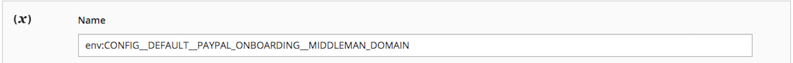

# Variables spécifiques au cloud

Les variables d’environnement spécifiques à Adobe Commerce sur les infrastructures cloud utilisent le préfixe `MAGENTO_CLOUD_*` :

| Variable | Description |
| -------- | --------------- |
| `MAGENTO_CLOUD_APP_DIR` | Chemin d’accès absolu au répertoire de l’application. |
| `MAGENTO_CLOUD_APPLICATION` | Un objet JSON codé en base64 qui décrit l’application. Il correspond au contenu du fichier `.magento.app.yaml` et comporte des sous-clés. |
| `MAGENTO_CLOUD_APPLICATION_NAME` | Nom de l’application paramétrée dans le fichier `.magento.app.yaml`. |
| `MAGENTO_CLOUD_DOCUMENT_ROOT` | Chemin d’accès absolu à la racine du document web, le cas échéant. |
| `MAGENTO_CLOUD_ENVIRONMENT` | Nom de la branche d’environnement. |
| `MAGENTO_CLOUD_PROJECT` | Identifiant du projet. |
| `MAGENTO_CLOUD_RELATIONSHIPS` | Objet JSON codé en base64 qui représente la définition de point d’entrée de clé (nom de relation) et de valeur (tableaux de paires de relations). Chaque définition de point d’entrée de relation est une forme décomposée d’URL. Il comporte un `scheme`, un `host`, un `port` et _éventuellement_ un `username`, un `password`, un `path`, ainsi que des informations supplémentaires dans `query`. |
| `MAGENTO_CLOUD_ROUTES` | Décrire les itinéraires définis dans le fichier de `.magento/routes.yaml` d’environnement. |
| `MAGENTO_CLOUD_TREE_ID` | Identifiant d’arborescence de l’application, qui correspond au SHA de l’arborescence dans Git. |
| `MAGENTO_CLOUD_VARIABLES` | Objet JSON codé en base64 avec des paires clé-valeur, telles que `"key":"value"`. |
| `MAGENTO_CLOUD_LOCKS_DIR` | Fournit le chemin d’accès au point de montage pour le fournisseur de verrouillage sur l’infrastructure cloud. Le fournisseur de verrous empêche le lancement de tâches et de groupes cron en double. |

>[!WARNING]
>
>Pour ajouter des variables d’environnement à [remplacer les paramètres de configuration](https://experienceleague.adobe.com/docs/commerce-operations/configuration-guide/paths/override-config-settings.html) à l’aide de l’[[!DNL Cloud Console]](../project/overview.md), vous devez ajouter le préfixe `env:` au nom de la variable, comme dans l’exemple suivant :
>
>

Comme les valeurs peuvent changer au fil du temps, il est préférable d’inspecter la variable au moment de l’exécution et de l’utiliser pour configurer votre application. Par exemple, utilisez la variable `MAGENTO_CLOUD_RELATIONSHIPS` pour récupérer les relations liées à l’environnement comme suit :

```php
<?php
/**
  * Get relationships information from cloud environment variable.
  *
  * @return mixed
  */
    protected function getRelationships()
    {
        return json_decode(base64_decode($_ENV["MAGENTO_CLOUD_RELATIONSHIPS"]), true);
    }
```

## Affichage des variables d’environnement

Vous pouvez utiliser la commande `env:config:show` du [package de `ece-tools`](../dev-tools/package-overview.md) pour afficher une liste de variables pour l’environnement actuel.

```bash
php ./vendor/bin/ece-tools env:config:show variables
```

Exemple de sortie pour l’option `variables` :

```
Magento Cloud Environment Variables:
+-----------------------------------+----------------------------------+
| Variable name                     | Value                            |
+-----------------------------------+----------------------------------+
| ADMIN_EMAIL                       | commerceadmin@company.com        |
| ADMIN_PASSWORD                    | 123123q                          |
+-----------------------------------+----------------------------------+
```
