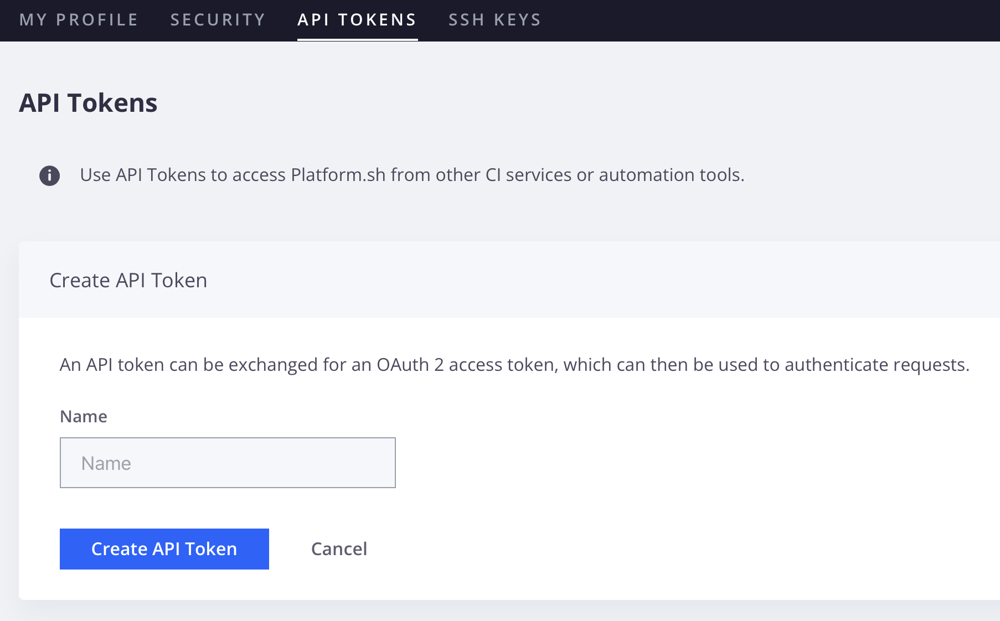

# Gérer l’accès utilisateur

Les projets Adobe Commerce sur l’infrastructure cloud utilisent l’accès en fonction du rôle. Deux rôles sont disponibles au niveau du projet :

- **Administrateur de projet** : accès en écriture à tous les environnements de projet et possibilité de gérer les utilisateurs, le code push et de mettre à jour les paramètres du projet. (Anciennement appelé **Super admin**)
- **Visionneuse de projets** : accès en lecture seule à tous les environnements de projet.

Les visionneuses de projets ne peuvent effectuer de tâches dans aucun environnement. Cependant, vous pouvez leur accorder un accès en écriture à un type d’environnement spécifique.

L’accès au niveau de l’environnement dépend du type d’environnement : production, évaluation et développement. Accorder à un utilisateur l’autorisation _observateur_ d’accéder aux environnements _développement_ signifie qu’il peut afficher **tous** les environnements de développement du projet. Le tableau suivant clarifie les capacités accordées à chaque niveau d’autorisation :

| Niveau d’autorisation | Accès | Accès SSH |
| ------------------ | ----------- | :----------: |
| **Admin** | Effectuer des tâches d’administration, telles que la modification des paramètres, le code push, l’exécution de tâches et la gestion de branches, y compris la fusion avec l’environnement parent | Oui |
| **Contributeur** | Code push et branchement de l’environnement ; impossible de modifier les paramètres ou d’exécuter des actions | Oui |
| **Visionneuse** | Accès en lecture seule au type d’environnement | Non |
| **Aucun accès** | Pas d’accès au type d’environnement | Non |

{style="table-layout:auto"}

Vous pouvez ajouter des utilisateurs et affecter des rôles à l’aide de l’interface de ligne de commande `magento-cloud` ou du [!DNL Cloud Console].

>[!BEGINSHADEBOX]

**Conditions préalables :**

- Utilisateur enregistré avec un Adobe ID. Un utilisateur doit [s’inscrire à un compte Adobe](https://account.adobe.com), puis initialiser son compte [Cloud](https://console.adobecommerce.com) en consultant le site [https://console.adobecommerce.com](https://console.adobecommerce.com) avant de pouvoir l’ajouter à un projet cloud.
- Un utilisateur disposant du rôle **Admin** ne peut pas gérer les utilisateurs avec l’interface de ligne de commande `magento-cloud`. Seuls les utilisateurs dotés du rôle **Propriétaire du compte** peuvent gérer les utilisateurs.

>[!ENDSHADEBOX]

## Gestion des utilisateurs à l’aide de l’interface de ligne de commande

Utilisez l’interface de ligne de commande `magento-cloud` pour gérer les utilisateurs et intégrer aux systèmes automatisés :

- `magento-cloud user:add`-ajouter un utilisateur au projet
- `magento-cloud user:delete`-supprimer un utilisateur
- `magento-cloud user:list [users]` les utilisateurs du projet
- `magento-cloud user:role` ou modifier le rôle de l’utilisateur
- `magento-cloud user:update`-mettre à jour le rôle utilisateur sur un projet

Les exemples suivants utilisent l’interface de ligne de commande `magento-cloud` pour ajouter un utilisateur, configurer des rôles, modifier les affectations de projet et affecter des rôles utilisateur.

**Pour ajouter un utilisateur et affecter des rôles** :

1. Utilisez l’interface de ligne de commande `magento-cloud` pour ajouter l’utilisateur .

   ```bash
   magento-cloud user:add
   ```

   >[!IMPORTANT]
   >
   >L’utilisateur ou l’utilisatrice doit disposer d’une Adobe ID. Voir les [conditions préalables](#add-users-and-manage-access).

1. Suivez les invites : indiquez l’adresse e-mail de l’utilisateur, définissez les rôles de type projet et environnement, puis ajoutez l’utilisateur.

   > Exemples d’invites

   ```
   Enter the user's email address: alice@example.com
   
   Email address: alice@example.com
   
   The user's project role can be admin (a) or viewer (v).
   
   Project role (default: viewer) [a/v]: viewer
   
   The user's environment type role(s) can be admin (a), viewer (v), contributor (c) or none (n).
   
   Role on type development (default: none) [a/v/c/n]: none
   Role on type production (default: none) [a/v/c/n]: admin
   Role on type staging (default: none) [a/v/c/n]: admin
   
   Adding the user alice@example.com to (project_id):
   Project role: viewer
     Role on type production: admin
     Role on type staging: admin
   
   Are you sure you want to add this user? [Y/n] y
   Adding the user to the project
   ```

   Après avoir ajouté l’utilisateur, Adobe envoie un e-mail à l’adresse spécifiée avec les instructions pour accéder au projet d’infrastructure cloud d’Adobe Commerce.

### Afficher le rôle de projet d’un utilisateur

```bash
magento-cloud user:get alice@example.com
```

>Exemple de réponse :

```
Current role(s) of User (alice@example.com) on Production (project_id):
  Project role: admin
```

### Ajout d’un utilisateur à plusieurs environnements

Pour ajouter un utilisateur en tant que `viewer` dans un environnement `Production` et en tant que `contributor` dans un environnement `Integration` :

```bash
magento-cloud user:add alice@example.com -r production:v -r integration:c
```

### Mettre à jour les autorisations de l’environnement utilisateur

Pour mettre à jour les autorisations de l’environnement utilisateur afin de les `admin` sur l’environnement `Production` :

```bash
magento-cloud user:update alice@example.com -r production:a
```

## Gestion des utilisateurs à partir de l’[!DNL Cloud Console]

Vous pouvez utiliser l’[[!DNL Cloud Console]](../../get-started/cloud-console.md) pour ajouter des autorisations et utiliser la fonction _Modifier_ pour modifier les autorisations d’un utilisateur existant.

>[!IMPORTANT]
>
>L’utilisateur ou l’utilisatrice doit disposer d’une Adobe ID. Voir les [conditions préalables](#add-users-and-manage-access).

### Ajout d’un utilisateur au projet

1. Connectez-vous à l’[[!DNL Cloud Console]](https://console.adobecommerce.com/) .

1. Sélectionnez un projet dans la liste _Tous les projets_.

1. Dans le tableau de bord Projet, cliquez sur l’icône de configuration en haut à droite.

1. Sous _Paramètres du projet_, cliquez sur **[!UICONTROL Access]**.

1. Dans la vue _Accès_, cliquez sur **[!UICONTROL Add]**.

1. Complétez le formulaire _[!UICONTROL Add User]_:

   - Saisissez l’adresse e-mail de l’utilisateur.

   - **[!UICONTROL Project admin]**—accorder des droits d&#39;administrateur à tous les paramètres et types d&#39;environnements.

   - **[!UICONTROL Environment types and permissions]** : octroi d&#39;accès et de niveaux d&#39;autorisation spécifiques à certains types d&#39;environnements. _Pas d’accès_, _Admin_ (modifier les paramètres, exécuter une action, fusionner le code), _Contributeur_ (code push) ou _Visionneuse_ (affichage uniquement).

   >[!TIP]
   >
   >Seul un **administrateur de projet** peut gérer les utilisateurs dans n’importe quel environnement. Pour accorder à un utilisateur l’accès à l’onglet **Accès**, un autre **administrateur de projet** ou le **propriétaire de compte** doit lui attribuer le rôle **administrateur de projet**.

1. Cliquez sur **[!UICONTROL Add User]**.

   >[!IMPORTANT]
   >
   >L’ajout d’un utilisateur ne déclenche pas automatiquement un déploiement.

1. Après avoir ajouté des utilisateurs, redéployez tous les environnements pour appliquer les modifications. L’ajout d’un utilisateur ne déclenche pas automatiquement un déploiement. Le redéploiement est une étape importante pour s’assurer que l’utilisateur peut accéder à un environnement à l’aide de SSH ou effectuer des tâches d’administration.

Après avoir ajouté l’utilisateur, Adobe envoie un e-mail à l’adresse spécifiée avec les instructions pour accéder au projet d’infrastructure cloud d’Adobe Commerce.

## Exigences d’authentification des utilisateurs

Pour une sécurité accrue, Adobe fournit une application d’authentification multifacteur (MFA) au niveau du projet afin d’exiger une authentification à deux facteurs (TFA) pour l’accès SSH à Adobe Commerce dans les environnements et le code source du projet d’infrastructure cloud. Voir [Activer MFA pour SSH](multi-factor-authentication.md).

Lorsque l’application MFA est activée sur un projet d’infrastructure cloud d’Adobe Commerce, tous les utilisateurs disposant d’un accès SSH à un environnement dans ce projet doivent activer TFA sur leur compte d’infrastructure cloud d’Adobe Commerce. Pour les processus automatisés, vous pouvez créer un utilisateur de la machine et un jeton API pour vous authentifier à partir de la ligne de commande.

Après avoir ajouté un utilisateur à un projet cloud, demandez à l’utilisateur de vérifier les paramètres de sécurité de son compte et d’ajouter les configurations de sécurité suivantes si nécessaire :

- **Activer TFA**—Respectez les normes de sécurité et de conformité en configurant l&#39;authentification à deux facteurs. Les projets configurés avec [application de l’AMF](multi-factor-authentication.md) nécessitent un accès à des ressources numériques sur les comptes qui utilisent SSH pour accéder aux projets.

- **Activer les clés SSH** : les utilisateurs qui nécessitent l’accès à Adobe Commerce sur les référentiels de code source de l’infrastructure cloud doivent activer les clés SSH sur leur compte. Voir [Connexions sécurisées](../development/secure-connections.md).

- **Créer un jeton API** : les utilisateurs doivent générer un jeton API utilisé pour l’accès SSH à un environnement. Vous avez besoin du jeton pour activer les workflows d’authentification pour les processus automatisés.

  Dans les projets pour lesquels l’application MFA est activée, vous devez utiliser le jeton API pour authentifier les demandes d’accès SSH provenant de comptes automatisés. Le jeton permet aux processus automatisés de contourner les workflows d’authentification qui nécessitent un accès à des informations personnelles.

### Activer l’AFE pour les comptes cloud

Adobe Commerce sur les infrastructures cloud prend en charge TFA à l’aide de l’une des applications suivantes :

- [Authentificateur Google (Android/iPhone)](https://support.google.com/accounts/answer/1066447?hl=en)
- [Authy (Android/iPhone)](https://authy.com/features/)
- [FreeOTP (Android)](https://play.google.com/store/apps/details?id=org.fedorahosted.freeotp)
- [Authentificateur GAuth (système d’exploitation Firefox, ordinateur de bureau, autres)](https://github.com/gbraad-apps/gauth)

Les instructions d’installation de l’application d’authentification et d’activation de TFA sont disponibles sur la page _Paramètres du compte_ de la [!DNL Cloud Console].

**Pour activer TFA sur votre compte utilisateur** :

1. Connectez-vous à [votre compte](https://console.adobecommerce.com).

1. Dans le menu supérieur droit du compte, cliquez sur **[!UICONTROL My Profile]**.

1. Dans l’onglet _Sécurité_, cliquez sur **[!UICONTROL Set up application]**.

1. Si votre appareil mobile ne dispose pas d’une application d’authentification approuvée, suivez les instructions fournies pour l’installer.

1. Ajoutez votre compte d’infrastructure cloud Adobe Commerce à l’application d’authentification.

   - Sur votre appareil mobile, ouvrez l’application d’authentification. Ajoutez ensuite le code de configuration à l’application.

   - Sur la page [!UICONTROL **[!UICONTROL TFA set up - Application]**], saisissez le code TFA de votre appareil mobile dans le champ **[!UICONTROL Application verification code]** .

   - Cliquez sur **[!UICONTROL Verify and save]**.

     Si le code est valide, Adobe envoie une notification à l’adresse e-mail du compte confirmant que ce dernier dispose désormais de l’autorisation TFA.

1. Facultatif. Activez les paramètres _Navigateur approuvé_ pour mettre en cache le code d’authentification dans le navigateur pendant 30 jours.

   Cette configuration réduit le nombre de défis d’authentification lors de la connexion au projet.

1. Cliquez sur **Enregistrer** ou **Ignorer**.

1. Enregistrez les codes de récupération.

   - Sur la page _Configuration de l’AFE - Récupération_ codes, copiez et enregistrez les codes de récupération afin de vous connecter à votre projet d’infrastructure cloud Adobe Commerce lorsque vous ne pouvez pas accéder à votre appareil mobile ou à votre application d’authentification.

   - Copiez les codes de récupération vers un autre emplacement ou notez-les au cas où vous perdriez l’accès à votre appareil ou à votre application d’authentification.

   - Cliquez sur **Enregistrer** pour enregistrer les codes dans votre compte afin de les afficher et de les gérer à partir des paramètres de sécurité de votre compte.

     >[!WARNING]
     >
     >Si vous perdez l’accès à un compte avec TFA et que vous ne disposez pas de la liste des codes de récupération, vous devez contacter l’administrateur de votre projet ou [Envoyer un ticket d’assistance Adobe Commerce](https://experienceleague.adobe.com/docs/commerce-knowledge-base/kb/help-center-guide/magento-help-center-user-guide.html?lang=fr#submit-ticket) pour réinitialiser l’application TFA.

1. Une fois la configuration de l’AFE terminée, cliquez sur **Enregistrer** pour mettre à jour votre compte.

1. Authentifiez votre session en cours avec l’AFE.

   - Déconnectez-vous de votre compte.
   - Connectez-vous avec votre nom d&#39;utilisateur et votre mot de passe.
   - A l’invite, saisissez le code TFA de l’entrée `accounts.magento.cloud` de l’application d’authentification sur votre appareil mobile.

### Gestion de la configuration et des codes de récupération TFA

Vous pouvez gérer la configuration TFA d’un compte d’infrastructure cloud Adobe Commerce à partir de la section _Sécurité_ de la page _Mon profil_.

1. Connectez-vous à [votre compte](https://console.adobecommerce.com).

1. Dans le menu supérieur droit du compte, cliquez sur **[!UICONTROL My Profile]**.

1. Sur la page _Mon profil_, cliquez sur l’onglet **[!UICONTROL Security]**.

1. Utilisez les liens disponibles pour mettre à jour les paramètres de l’AFE pour votre compte Adobe Commerce sur l’infrastructure cloud :

   - Désactiver l’AFE
   - Réinitialiser l’application d’authentification
   - Ajouter ou supprimer des navigateurs approuvés
   - Afficher ou actualiser les codes de récupération de l&#39;AFE sur votre compte

### Création d’un jeton API

Un jeton API peut être échangé contre un jeton d’accès OAuth 2, qui peut ensuite être utilisé pour authentifier les requêtes.

Dans les projets pour lesquels l’application MFA est activée, vous devez disposer d’un jeton API pour activer l’accès SSH pour les utilisateurs de la machine et les processus automatisés.

>[!IMPORTANT]
>
>Protégez les valeurs de jeton API pour votre compte. N’exposez pas la valeur dans les exemples de code, les captures d’écran ou les communications client-serveur non sécurisées. En outre, n’exposez pas la valeur dans le code source stocké dans les référentiels publics.

**Pour créer un jeton API** :

1. Connectez-vous à [votre compte](https://console.adobecommerce.com).

1. Dans le menu supérieur droit du compte, cliquez sur **[!UICONTROL My Profile]**.

1. Sur la page _Mon profil_, cliquez sur l’onglet **[!UICONTROL API tokens]**.

1. Cliquez sur **[!UICONTROL Create API token]** et saisissez un nom, par exemple, spécifiez un nom correspondant à l’utilisateur de la machine ou au processus automatisé qui utilise le jeton API.

   

1. Cliquez sur **[!UICONTROL Create API token]**.
