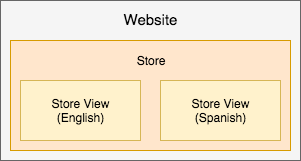

# Bonnes pratiques relatives à la configuration du magasin

Pour obtenir des informations détaillées sur la configuration de votre boutique, de vos sites et de vos sites Web, vous pouvez consulter le [Guide de l’utilisateur d’Adobe Commerce](https://experienceleague.adobe.com/docs/commerce-admin/user-guides/home.html). Cette page fournit des bonnes pratiques, des informations utiles et des instructions pour configurer vos magasins, sites et plus encore avec du contenu supplémentaire à publier au fil du temps et entre les versions.

## Campagnes marketing et promotions

Ces informations sont utiles pour Adobe Commerce sur les infrastructures cloud 2.1.X et 2.2.X.

Pour créer des campagnes et des promotions, créez les options et les paramètres dans [Évaluation du contenu](https://experienceleague.adobe.com/docs/commerce-admin/content-design/staging/content-staging.html). Cette fonctionnalité vous permet de créer et de prévisualiser vos campagnes avant de les rendre publiques pour les ventes aux clients. Les informations suivantes sont utiles. Pour obtenir des instructions exactes, consultez le contenu du guide de l’utilisateur d’Adobe Commerce associé.

Les _campagnes_ sont des événements marketing pour les ventes saisonnières, les nouvelles lignes de produits, etc. Chaque campagne peut inclure des thèmes personnalisés, des blocs de contenu, des widgets pour contrôler et afficher le contenu et des promotions associées à des règles de prix. En raison de la nature étendue d’une campagne, vous pouvez la créer avec une date de début et de fin via l’évaluation de contenu.

_Promotions_ propose des remises, des offres uniques, des coupons, des incentives pour les primo-acheteurs, etc. Vous créez ces promotions sous la forme de _Règles de prix_ qui définissent les conditions, les remises et les options pour encourager les clients à acheter. Vous pouvez créer des règles de prix sur le [panier](https://experienceleague.adobe.com/docs/commerce-admin/marketing/promotions/cart-rules/price-rules-cart.html) ou le [catalogue](https://experienceleague.adobe.com/docs/commerce-admin/marketing/promotions/catalog-rules/price-rules-catalog.html), avec des options supplémentaires pour les bannières, les points de récompense, etc. Vous pouvez planifier des campagnes pour vos promotions, en appliquant des règles de prix pour les événements majeurs tels qu’une nouvelle ligne de produits ou des ventes saisonnières.

Vous trouverez ci-dessous des conseils pour vous aider à créer, mettre à jour et gérer des promotions et des campagnes :

* Une promotion peut faire partie d’une campagne. Une campagne ne peut pas faire partie d’une promotion. Vous pouvez avoir des listes de promotions comme règles de prix à utiliser plusieurs fois, avec plusieurs campagnes.
* Lorsque vous créez une promotion, elle crée toujours une campagne initiale inactive. Il comporte une date de début, mais pas de fin. Vous pouvez ignorer cette campagne initiale. Vous pouvez planifier une nouvelle mise à jour avec le planning de campagne approprié et le rendre actif.
* Une campagne comporte une date de début et de fin, pas de promotion. Le planificateur qui s’affiche lorsque vous créez une promotion ne configure pas les dates de début et de fin de la promotion. Elle permet de planifier une campagne pour cette promotion lorsque vous êtes sur la page de configuration de la promotion.
* Vous ne pouvez pas effectuer de modification directe dans le contenu échelonné. Si vous devez modifier des paramètres et des options dans la campagne, modifiez l’original ou un réplica et poussez pour remplacer dans le contenu intermédiaire. Par exemple, si vous ne définissez pas de date de fin pour une campagne, vous devez modifier l’original et activer pour mettre à jour.

## Tarification avancée et contenu échelonné

Ces informations sont utiles pour Adobe Commerce sur les infrastructures cloud 2.1.X et 2.2.X.

En règle générale, vous pouvez définir [Tarification avancée](https://experienceleague.adobe.com/docs/commerce-admin/catalog/products/pricing/pricing-advanced.html) pour les produits via la zone **Produits** > **Catalogues** de l’administrateur. Avec le contenu intermédiaire, effectuez quelques étapes supplémentaires pour ajouter le prix à une promotion et à une campagne.

Pour modifier la tarification avancée et mettre à jour l’évaluation du contenu :

1. Connectez-vous à l’administrateur.
1. Accédez à **Produits** > **Catalogue**, sélectionnez un produit et modifiez-le.
1. Dans l&#39;onglet Tarification, sélectionnez **Tarification avancée**. Modifiez le prix et enregistrez les modifications.
1. En haut de la page, cliquez sur **Planifier une nouvelle mise à jour**.
1. Créez une promotion pour le produit.
1. Complétez les informations sur la promotion. Pour le Planificateur, saisissez une date et une heure de début et de fin.
1. Enregistrez la promotion. Une campagne initiale inactive est créée.
1. Vous pouvez Prévisualiser pour consulter le prix spécial, le nom de la promotion, le prix normal et la période planifiée pour la campagne.

Pour effectuer d&#39;autres étapes, vous pouvez suivre les instructions suivantes : [Planifier des modifications pour les règles de prix de catalogue](https://experienceleague.adobe.com/docs/commerce-admin/marketing/promotions/catalog-rules/price-rule-catalog-scheduled-changes.html). Cliquez sur **Suivant** pour suivre les étapes.

## Règles de prix

Les règles de prix peuvent inclure une logique et des conditions aussi illimitées que votre imagination marketing. Voici quelques exemples populaires : Achetez-en un gratuit, Achetez-en un avec une réduction de 50 %, une réduction de 25 $ sur les commandes de plus de 100 $, etc.

Pour créer une règle de prix, consultez le [Guide de l’utilisateur d’Adobe Commerce](https://experienceleague.adobe.com/docs/commerce-admin/marketing/promotions/catalog-rules/price-rules-catalog-create.html).

Vous trouverez ci-dessous un exemple de création d&#39;une règle de prix pour une remise Première commande uniquement. Pour bénéficier de cette réduction, vous devez :

* Créez une règle de prix avec un [segment client](https://experienceleague.adobe.com/en/docs/commerce-admin/customers/segments/customer-segment-price-rule) avec une condition : Nombre total de commandes inférieur à 1.
* Ajoutez ce segment client en tant que condition à la règle de panier
* Facultatif - Ajoutez des conditions et des règles pour appliquer les remises à des SKU ou catégories de produits spécifiques pour les achats ciblés.

Cela permet de s’assurer que les nouveaux clients ou les clients existants qui n’ont pas effectué d’achat reçoivent la remise uniquement lors de leur première commande. Vous pouvez créer des bannières et envoyer des promotions par e-mail pour la première remise sur un achat.

## Vues de la boutique

Vous pouvez configurer et exécuter plusieurs magasins avec une seule implémentation d’Adobe Commerce sur l’infrastructure cloud. Voir [Configuration de plusieurs sites web ou magasins](multiple-sites.md).

Pour les magasins qui n’interagissent pas entre eux, vous pouvez créer plusieurs _sites web_. Chaque site web comporte des articles spécifiques, des données client, un passage en caisse et un panier qui ne sont pas partagés avec d’autres sites web dans Adobe Commerce.

Chaque site web peut inclure un ou plusieurs _magasins_ avec différentes catégories et articles, des données client partagées, un passage en caisse et un panier. Pour ces magasins, un client peut s’inscrire une seule fois et acheter différents catalogues de produits avec un seul passage en caisse.

Vous pouvez également créer des _vues de magasin_ pour différentes langues, mises en page et conceptions. Chaque vue peut avoir un domaine, une marque et une langue distincts lors du partage d’articles, de données client, de paiements et de panier.

Voici des exemples pour mieux les expliquer :

* Site web unique avec un magasin et deux vues pour les paramètres régionaux anglais et espagnol. Toutes les données d’article, les clients, le passage en caisse et le panier sont partagés.

  

* Un seul site web avec un magasin pour les vêtements féminins comprend deux vues : une pour l&#39;anglais et une pour l&#39;espagnol. Le magasin de vêtements pour enfants comprend une vue unique en anglais. Toutes les données d’article, les clients, le passage en caisse et le panier sont partagés. Les magasins peuvent avoir différents domaines et thèmes.

  

* Deux sites web, l’un pour l’habillement et l’autre pour la décoration de la maison, avec différents catalogues et articles distincts, des données client et un panier. Chaque site web peut comporter plusieurs magasins et vues partageant des articles, des données client, des paiements et des paniers uniquement au sein de ce site web.

  

>[!WARNING]
>
>Les données du catalogue se développent à mesure que vous augmentez le nombre de sites web et de boutiques. Selon l’architecture de votre projet, les magasins supplémentaires peuvent entraîner un processus d’indexation plus long et des temps de réponse plus lents pour les pages de catalogue non mises en cache. Adobe vous recommande de surveiller étroitement les performances du site.
